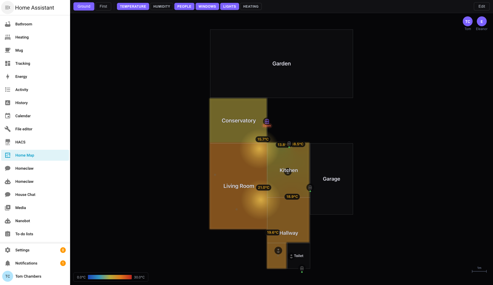
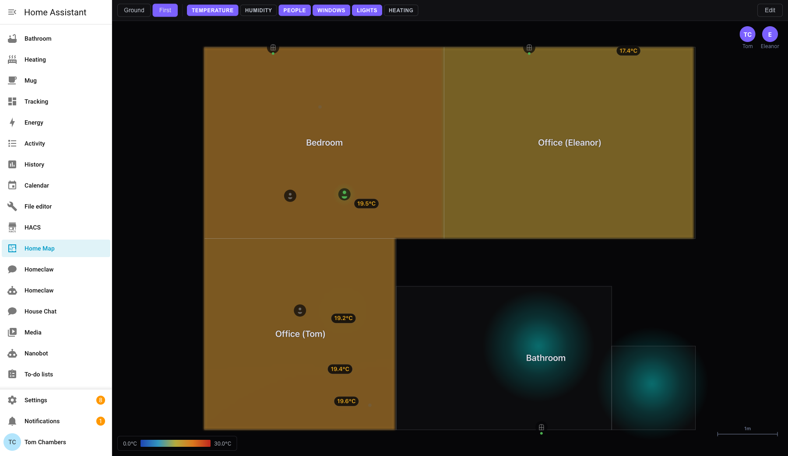
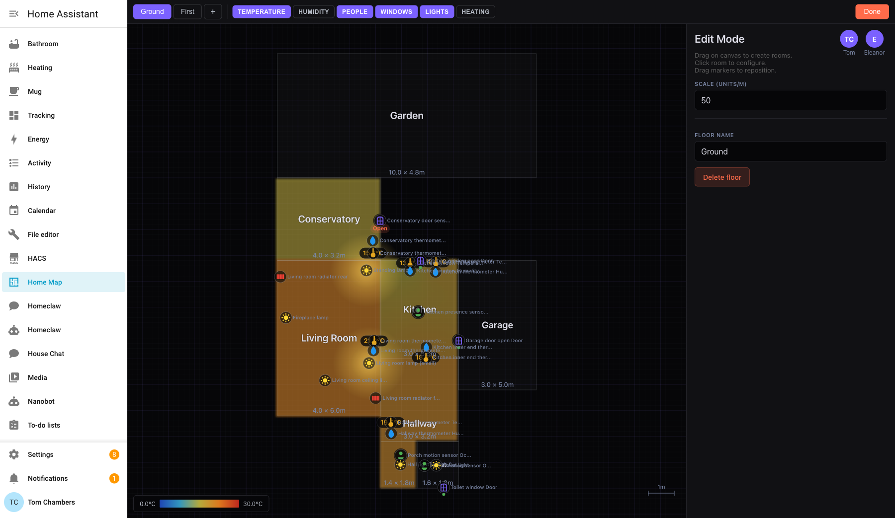

# Home Map

An interactive floor plan panel for Home Assistant. View your home's rooms with live sensor data overlays, heatmaps, and device status — all from a canvas-drawn map in your sidebar.

## Features

- **Interactive floor plan** — drag to create rooms, resize, position sensors
- **Temperature & humidity heatmaps** — color-coded overlays with absolute scales
- **Live sensor values** — temperature, humidity, occupancy displayed on the map
- **Window/door status** — open/closed indicators at a glance
- **Light visualization** — glow effects showing which lights are on and their color
- **Heating status** — radiator/climate entity display
- **Occupancy detection** — presence indicators per room
- **Multi-floor support** — tab between floors, synced with HA floor registry
- **Auto-discovery** — rooms auto-generated from HA areas, entities matched by area
- **Edit mode** — full drag-and-drop editor for room layout and sensor placement
- **Pan & zoom** — scroll to pan, pinch/ctrl+scroll to zoom

## Installation

### HACS (recommended)

1. Open HACS in Home Assistant
2. Click the three dots menu → **Custom repositories**
3. Add `https://github.com/tomchambers2/ha-home-map` with category **Integration**
4. Search for "Home Map" and install
5. Restart Home Assistant
6. Go to **Settings → Devices & Services → Add Integration → Home Map**

### Manual

1. Copy `custom_components/home_map/` to your HA `config/custom_components/` directory
2. Restart Home Assistant
3. Go to **Settings → Devices & Services → Add Integration → Home Map**

## Usage

After installation, "Home Map" appears in your sidebar. The panel auto-generates rooms from your HA areas and floors.

### View mode
- Toggle layers (temperature, humidity, people, windows, lights, heating) in the toolbar
- Click rooms to select them
- Pan with two-finger scroll, zoom with pinch or ctrl+scroll
- Double-click to reset the view

### Edit mode
- Click **Edit** to enter edit mode
- Drag on empty canvas to create new rooms
- Click a room to configure: assign HA area, add/remove sensors and devices
- Drag sensors from the sidebar onto the canvas to position them
- Resize rooms using corner/edge handles
- Shift+click multiple rooms to merge them
- Press Delete to remove selected element or room

## Screenshots

### Ground floor with temperature heatmap

### First floor

### Edit mode

